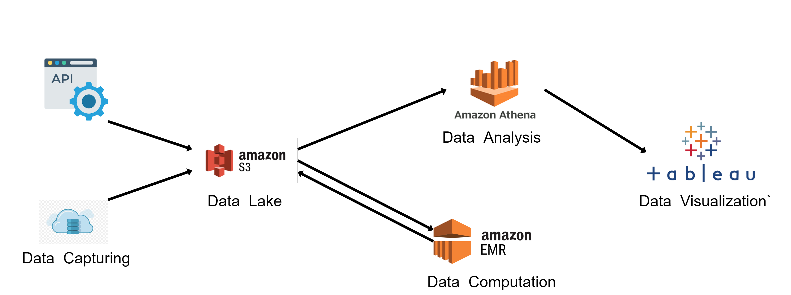

# Covid-19 Aviation Analysis
#### We aim to analyse Covid-19 impacts on Aviation Industry.

### Team Members:
- Dhruv Patel
- Himalya Bachwani
- Kishan Thumar
- Rahil Balar

### Data Pipeline: 

### Project Working:
.png)

### Dataset:
Delay Data : https://1sfu-my.sharepoint.com/:f:/g/personal/krt4_sfu_ca/EsQhv_uPoFhMnibqiD4s29EBkbo7h_cXaS84qL34N7Chhg?e=IMTE3n    
Passenger Data : https://1sfu-my.sharepoint.com/:f:/g/personal/krt4_sfu_ca/EkTjMdv6AZdJiTE03igJ_K0BgvISiD6hHqUp-UFjP7nS3A?e=jCvyVB

### Tableau link of our project:
Basic Visualization: https://public.tableau.com/app/profile/dhruv4657/viz/Covid-19AviationAnalysis/Airline-Covid  
Advance Visualization: https://public.tableau.com/app/profile/himalya1749/viz/CovidAviationUSAnalysis/CovidDepDelay

### Steps to run the project:
Refer to running.md file

### Report PDF:
https://drive.google.com/file/d/1C7EXCqsEuBQRJIMSBDOPay6wfFFIWj42/view?usp=sharing

### Presentation: 
https://prezi.com/view/cc8SFviUjjFH8eDfnglP/

### Demo: 
https://drive.google.com/file/d/1ytwrvmqw21n7h3PQS5NFBw78V01hGxos/view?usp=sharing

